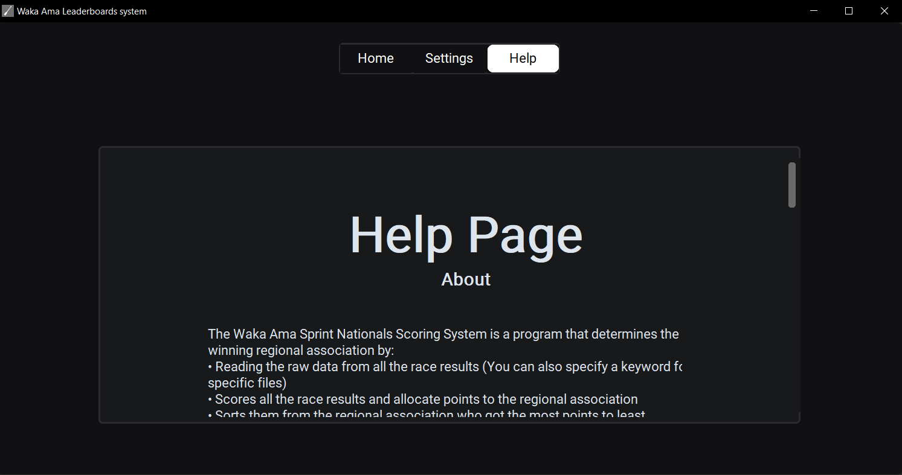
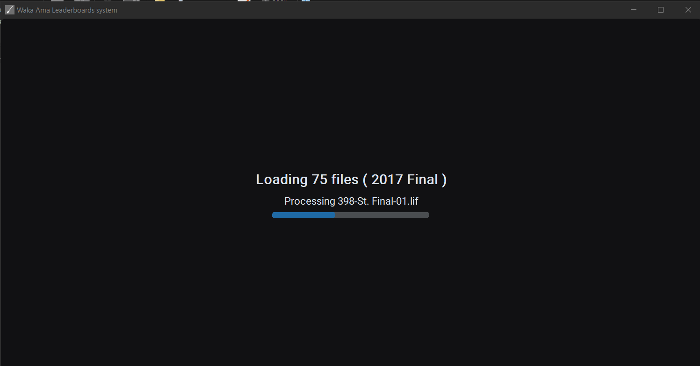

# Waka Ama Leaderboards system

A graphical User Interface program programmed in python that read and scores .lif files of the Waka Ama Nationals. Displays the results of the regional association winner. Can be exported to .csv file.


## Demo


## Screenshots






## Features

- Settings screen
- Help screen 
- Select Year screen with available years and files inside those years and input for years and keywords
- Loading screen with number of files being processed, what year and if keyword specified
- Results screen with regional association results table (place, name and points/score)
- Save to CSV option
- Toggle disqualified/DNS/DQ tags
- Toggle show file errors
- Modify Scoring criteria (Place:Score)
- Error and success Messageboxes

## Installation

Clone the repository 

```
  git clone https://github.com/frankiephs/DTP_waka_ama.git
```

install the dependencies/requirements
```
  pip install -r requirements.txt
```
run the program
```
python main.py
``` 


## FAQ

#### What platforms does this program support?

Tested and developed in windows. I used combination of native libraries and external extensions libraries of these libraries
which technically support multi-platform.

#### How to install, I do not have git.

download the zip file and proceed installing the dependencies/requirements

#### The program does not start

Make sure you installed the right version and make sure you followed the instructions correctly

#### settings does not save

in windows, it automatically restarts the program after you click save. If it does not, click the save button then restart to save changes.

#### How to use the scoring criteria

to use the scoring criteria, it must follow these specific rules:
- the input text should always end with curly brackets (opening and ending curly brackets) "{" "}"
e.g. { "places":score }
- each item should have a `"place":Score` format.
e.g. `"1":12` this means first place will get 12 points
- the last item should always include a greater than `">"` place. you can change the value if you want
e.g. `{"1":10,">":100}` this means that any place greater than 1 will get 100 points.
- There should be atleast 1 place inside aside from the 'greater than' place.
- Both the place and the score should be a real number and/or a digit.


Always make sure your format is right and double check if you added some cases that is not supposed to be there.
In case you made an error, just copy paste this default settings for the scoring criteria.
```
{"1": 8, "2": 7, "3": 6, "4": 5, "5": 4, "6": 3, "7": 2, "8": 1, ">": 1}
```

#### How to reset settings

- to reset settings, go to the cloned folder and clear the program.settings contents. This will reset back to default.

## Authors

- [@frankiephs](https://github.com/frankiephs)


## Feedback

If you have any feedback, please reach out in the discussion

